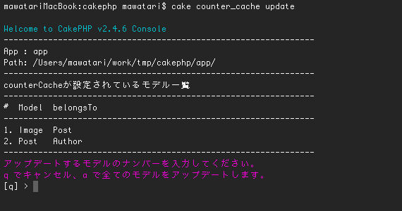

# updateCounterCache Shell for CakePHP


## Screenshot




## Usage
Updating counterCache.

```
cake counter_cache update
```

To select the model that you want to update.


## License

Copyright MAWATARI Naoto. ([mawatari.jp](http://mawatari.jp))

Licensed under The [MIT](http://www.opensource.org/licenses/mit-license.php) License. Redistributions of files must retain the above copyright notice.
